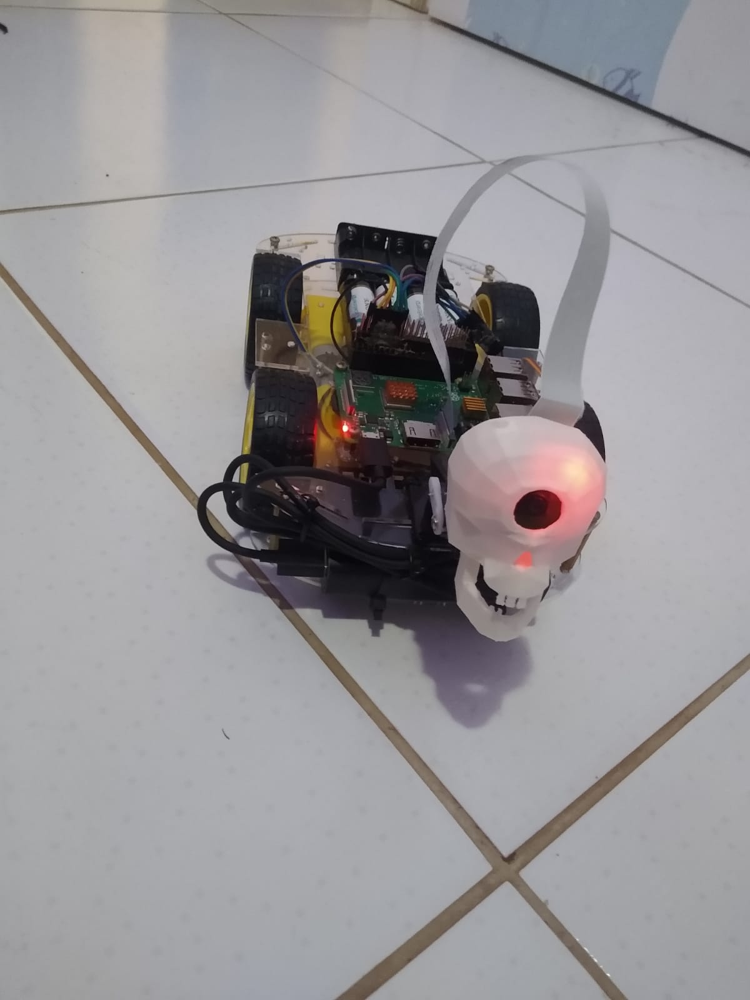
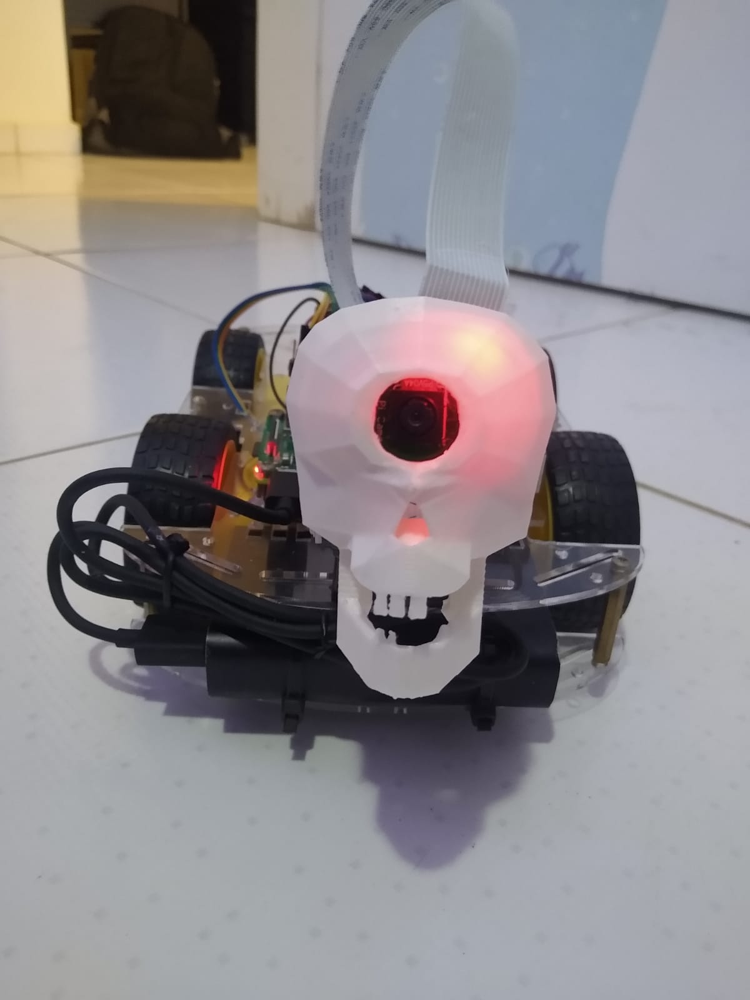
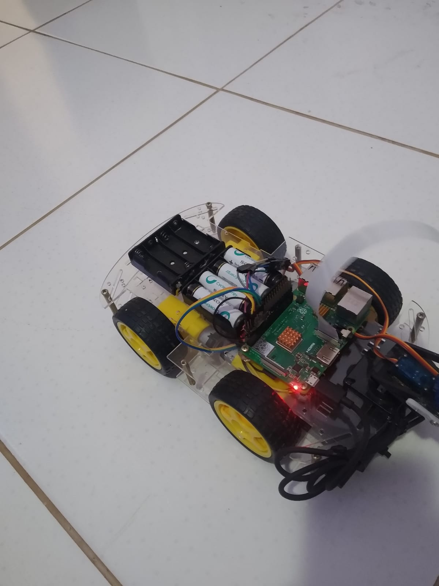

# Projeto atualmente sendo refatorado

## raspberry-python-robo

#### projeto em python para controlar robo utilizando:
* sockets - recebe comandos no formato Json
* Streaming de vídeo
* Camera com movimento vertical / horizontal utilizando servomotores

 

    
    
    

